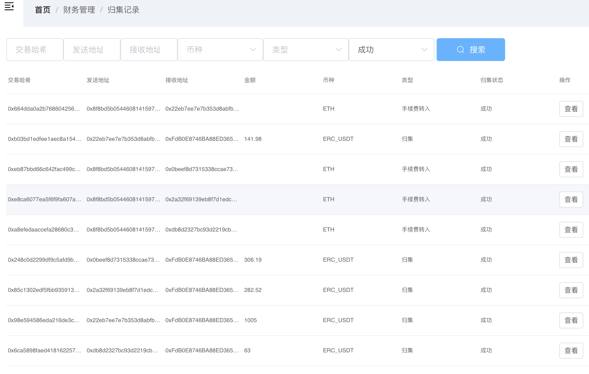

# 目录
系统功能概述:
```
支持多平台
支持同步配置
支持离线签名发送
支持地址导入业务
支持入账通知
支持自动归集
支持地址同步配置配置
支持归集记录查看
支持区块扫描
支持地址扫描
```

- 同步配置

## 多平台支持
```
一套系统支持多个业务系统;提供对平台的管理, 归集配置等功能
如配置归集后: 根据配置自动归集, 
```
- 平台列表图

- 平台配置图

## 地址管理
```
支持对平台创建地址, 并指定改地址同步的币种, 支持实时查看地址各币种余额, 查看地址交易记录
如: 针对omni(eth)地址可以同时支持btc(eth), usdt入账,也可单独配置仅支持其中一种
```
- 地址列表

- 创建地址

    
## 归集支持
```
根据平台归集配置,自动执行归集; 同时可以查看归集记录已经交易记录情况
```
- 归集记录

    
## 交易扫描
```
支持针对区块,和地址同时扫描,记录相关交易信息通知业务平台
```
- 交易列表

- 手动签名

- 扫描记录

